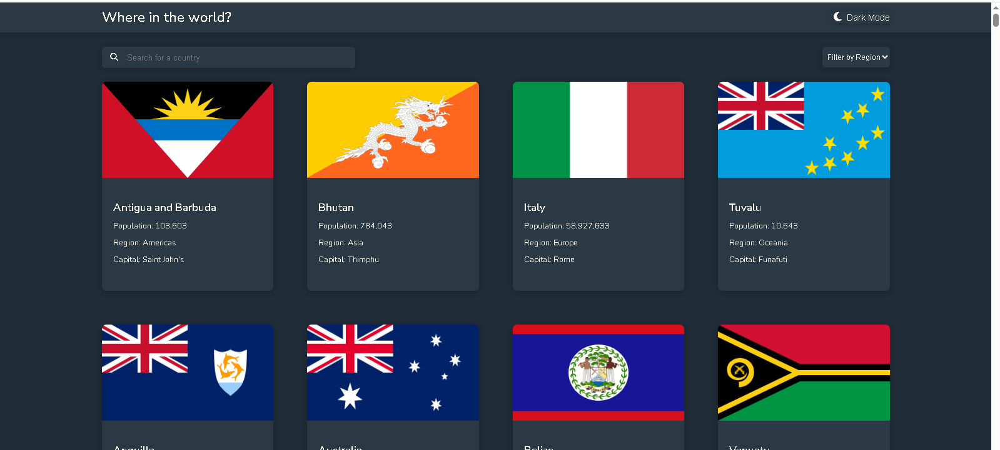
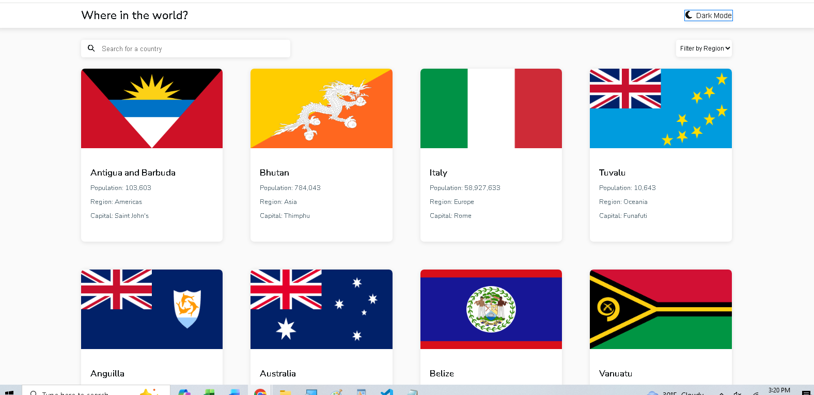
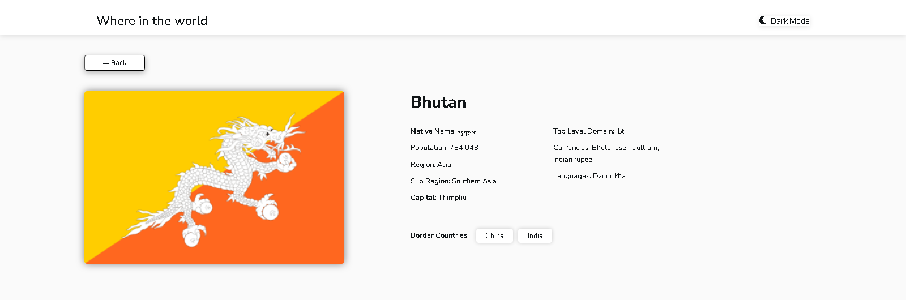
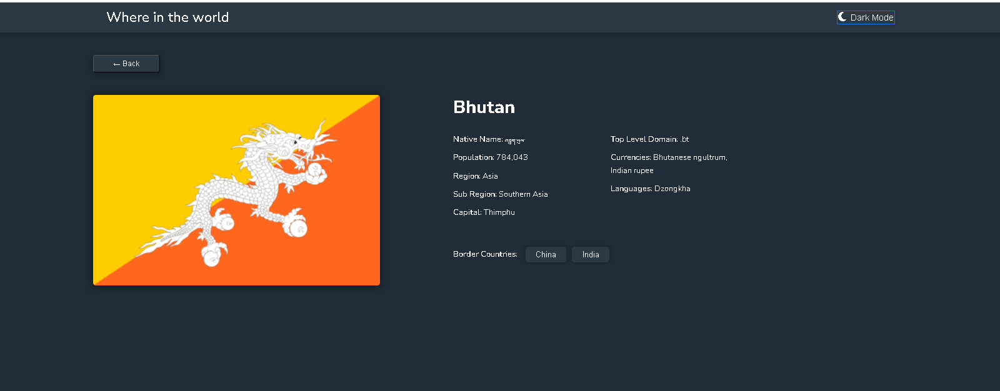
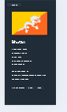
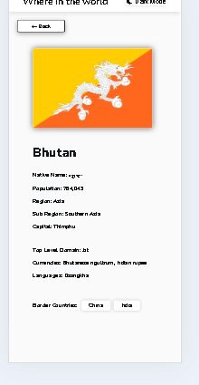
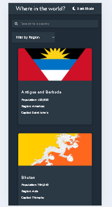
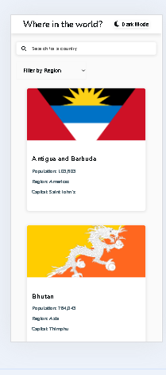

1. Project Overview

This project is a REST Countries API application with a color theme switcher (light and dark mode). It allows users to search for countries, view details of each country, and filter countries by region. The user interface is responsive and follows best practices for accessibility.

Notes: To run in console use main.ts
       UI  indexUi.ts and detailsPage.ts
       Run with index.html and when a card is clicked landing page countrycard.html will open
------------------------------------------------------------------------------------------------------
2. Folder structure

rest-countries-api-with-color-theme-switcher-master
|
├── src/
│   ├── models/
│   │   ├── Country.ts
│   ├── services/
│   │   └── apiService.ts
│   ├── utils/
│   │   ├── theme.ts
│   │   ├── errorHandler.ts  
|   |
|   |__main.ts //for UI
|   |
│   |── index.ts //for console
|   |___detailsPge.ts //for landingpage
|   |
|   |___styles/
|       |___style
|
|___index.html
|___countrycard.html //landing page
|
└── tsconfig.json|
|__package.package.json
|__README.md

-------------------------------------------------------------------------------------------------------------
3. Features

Countries List: Displays a grid of country cards.
Country Details: Click on any country card to view detailed information like name, population, capital, languages, currencies, etc.
Search: A search box that allows users to search countries by name.
Filter: Allows users to filter countries by region (Africa, Americas, Asia, Europe, Oceania).
Dark Mode Toggle: Users can toggle between light and dark themes.
Responsive Design: The application adapts to various screen sizes (mobile, tablet, desktop).
Accessibility: Accessible features like skip to content, ARIA labels, and focus management.
------------------------------------------------------------------------------------------------------------------------------------------
Input Validation:

Search Input Validation:
Trimmed extra spaces from the search input using trim() to avoid errors due to leading/trailing spaces.
Converted the input to lowercase to make the search case-insensitive, ensuring consistent results.
Empty Search Handling:
If the search input was empty, all countries were displayed again to reset the list.

Region Filter Validation:
Validated the region filter dropdown: if no region was selected, all countries were shown; otherwise, countries were filtered by the selected region.

Error Handling:
Caught errors from the API (e.g., missing data) and displayed user-friendly messages instead of crashing the app.

This ensures a smooth user experience and prevents errors from incorrect or empty input.
------------------------------------------------------------------------------------------------------------------------------------------

4. How It Works
Data Flow (Step-by-Step):

Initial Page Load:
On the homepage (index.html), the app loads country data from an external API (https://restcountries.com/).
Data is fetched asynchronously using JavaScript (via fetch()).

Displaying Countries:
The country cards are dynamically generated and displayed in a grid layout.
Each card contains a flag, country name, population, region, and capital.

Search:
When users type in the search box, the list of countries is filtered dynamically to match the search input.

Filter by Region:
Users can select a region from the dropdown filter to display only countries in that region.

Country Detail View:
When a user clicks on a country card, they are redirected to the details page (detail.html).
The details page loads the selected country’s information (e.g., languages, currencies, border countries) using its country code (code).

Dark/Light Mode:
The app saves the user's theme preference (light or dark) in the browser's local storage.
The theme is switched using the dark mode toggle button.

Error Handling:
Any API errors (e.g., if a country doesn’t have borders or if the API is down) are gracefully handled with custom error messages.
----------------------------------------------------------------------------------------------------------------------------------------
What I Did:

1. Setting Up the Project
Created the folder structure:
Initialized the project using TypeScript and created the tsconfig.json file to manage project settings.
Planned out the modules for:
Fetching country data from the API (apiServices.js).
Handling dark/light theme toggles (theme.js).
Managing errors (errorHandlers.js).

2. Building the Country Model (OOP Implementation)
Created a Country class with properties such as name, capital, languages, region, etc., based on the data from the API.
Added methods like formattedPopulation() to calculate and format population numbers.
Ensured each country fetched from the API was converted into a Country object for consistency in rendering and handling.

3. Implementing Utility Modules

Created setupDarkMode() function to handle the dark and light mode toggle

4. Handling API Communication (Async Workflow)
Developed the apiServices.js module to handle asynchronous fetching of country data using async/await.
Wrapped API requests in try/catch blocks to handle any network errors or API failures.
Ensured that parsing of JSON data was done safely, and any issues (e.g., empty responses) were handled gracefully.

5. Populating the UI

Waited for the API response before rendering any content on the page.
Converted each raw country data object into a Country instance for consistent behavior and structure.
Rendered country cards into the UI using DOM manipulation: displayed the flag, name, population, region, and capital for each country.

6. Adding Filtering, Searching, and Sorting

Implemented the search functionality that filters countries by name as users type.
Created a region filter dropdown to allow users to filter countries by Region (Africa, Asia, etc.).

7. Fixing UI/Rendering Bugs

Resolved styling issues during filtering by ensuring the existing DOM structure was reused instead of re-rendering from scratch.
Fixed issues with the empty UI state by ensuring elements like the search and filter results were displayed correctly when no countries matched the query.

8. Error Handling and Stability

Developed a custom error handling class (AppError) for API errors and other exceptions.
Displayed clean UI error messages when the API failed, or required data was missing.
Ensured that the app never crashes and remains stable, even if there is incomplete or missing data from the API.

9. Final Testing

Thoroughly tested all interactive features:
Filtering and searching functionality to ensure proper behavior.
Error handling scenarios, such as invalid country codes or missing data, were tested.
Debugged common issues, including:
404 errors from missing resources like flags.
Undefined fields (e.g., missing population data) or DOM mismatches.
Performed TypeScript compilation and final UI checks to ensure no errors or warnings remained.
---------------------------------------------------------------------
1. API → Fetch Data

The application starts by calling the external API using apiService.ts.
An asynchronous fetchCountryData() function sends a request and waits for the response using async/await.
The API returns raw JSON data containing Country objects.

2. Raw JSON -> Product Class (OOP Layer)

Each country from the API is passed into the Country class constructor.
This converts plain JSON objects into real Country instances.
This makes the data easy to work with, and we can use special methods (like getting the formatted population, theme toggle) to handle the data.This ensures every product behaves consistently across the application.

3. Processed Product Data -> UI Rendering

The final processed Country objects are sent to the rendercountries() function.
A document fragment is used to build cards efficiently.
Cards are injected into the grid container without destroying the layout.
The UI updates responsibly when filtering and searching.

5. User Interactions -> Filters & Searching

When the user types in the search bar or changes the region filter, the list of countries is updated.
Only the country list changes, and the UI stays smooth (no layout reset).

6. Errors -> ErrorHandler Module
If the API fails or there’s a problem with the data, we use error handling.
We show friendly error messages instead of the app crashing.

7. Final Output -> UI Display

The user sees:
API-powered Country cards
A list of countries with all the correct details.
Working search and filtering features.
Detail country imformation is also displayed when a card is clicked

--------------------------------------------------------------------------------
 
 Challenges Faced and Solutions in the Project
1. Implementing Add and Edit Post Functionality

Problem: Initially, when adding a post, the form would show success alerts even if the content was empty. Editing a post also didn’t update the post correctly in the UI or localStorage.

Solution: Added proper input validation to check that both title and content are provided. Implemented event delegation and unique identifiers for posts to ensure the correct post is updated in localStorage and displayed correctly in the UI after editing.

2. Data Persistence with localStorage

Problem: Posts were not consistently saving or updating in localStorage. Sometimes, edited posts were overwritten, or deleted posts reappeared after refreshing the page.

Solution: Created modular functions for CRUD operations (Create, Read, Update, Delete) to manage posts reliably. Added proper retrieval and parsing of JSON data to ensure the UI always reflected the current state of localStorage.

3. Search, Filter, and Sort Functionality

Problem: Filtering posts by category or searching by keyword sometimes conflicted with each other, leading to incorrect results or duplicated posts.

Solution: Implemented a sequential filtering logic: first filter by category, then search by keyword, and finally sort results. Ensured that each operation worked on a copy of the current posts array to avoid modifying the original data.

4. UI and Layout Issues

Problem: The layout broke on different screen sizes, and some elements like edit/delete buttons were misaligned. Notifications and modals overlapped with content.

Solution: Used CSS Flexbox and Bootstrap classes for responsive layout, adjusted margins and padding, and ensured buttons and alerts had consistent positioning. Tested the interface on multiple screen sizes for consistency.

5. Handling User Input and Preventing Errors

Problem: Users could submit empty forms or invalid data, causing the app to behave unexpectedly.

Solution: Added front-end validation with alerts for empty fields, prevented default form submission when data was invalid, and ensured all input was sanitized before saving to localStorage.

6. Performance and Event Handling

Problem: Adding multiple event listeners caused duplicate triggers and slow performance when many posts were present.

Solution: Used event delegation by attaching a single listener to the parent container for edit and delete actions. This reduced memory usage and ensured smooth interactions.

7. Dark Mode

Problem: 
The dark mode toggle worked on the main page but not on the country details page.
The half moon icon for the toggle was not visible.
Theme changes did not persist when navigating between pages.
Some elements, like detail cards and buttons, did not reflect dark mode styles.

Solutions:
Ensured the toggle button exists on all pages and attached the event listener safely using TypeScript’s null checks.
Corrected the Font Awesome CDN link to display the half moon icon.
Stored the selected theme in localStorage and applied it on page load so dark mode persists across pages.
Updated CSS so all elements, including headers, detail cards, and buttons, inherit dark mode styles.

8. Back Button

Problem:
Clicking the back button on the country page did not navigate correctly.
An empty page or broken layout appeared because the previous list of countries was not restored.

Solutions:
Used window.history.back() to reliably navigate to the previous page.
Optionally, added a list-section on the country page and re-rendered the country list when the back button was clicked.

10. Css Styling
Problem: Misaligned Headings
Solution: Use consistent margins, padding, and line-height properties, and align elements using flexbox or grid for proper positioning.

Problem: Inconsistent Font Sizes on Different Devices
Solution: Use responsive font sizes with vw, vh, rem or media queries to adjust font size based on the screen size, ensuring readability across devices.
-------------------------------------------------------------------------------------------------------------------------------------------------------------------
Learning & Takeaways

Gained hands-on experience with TypeScript, OOP, and async programming.
Learned how to connect API data to UI dynamically.
Practiced debugging DOM manipulation, event handling, and preserving CSS layout after updates.
Understood the importance of graceful error handling for better user experience.
--------------------------------------------------------------------------------------------------------

Reflection

Throughout the development of this project, I focused on creating a responsive and user-friendly interface while integrating the REST Countries API to fetch and display country data. I began by setting up the project structure, ensuring a clean separation of concerns with folders for scripts, styles, and services. TypeScript was used to handle asynchronous requests and ensure type safety across the application.

<!-- All the development process, challenges and the solutions implemented are listed above under different headings -->

In terms of functionality, I implemented searching and filtering features that allowed users to interact with the list of countries. 

One of the potential improvements I would focus on in the future is optimizing performance for mobile devices, especially when dealing with large data sets. Although the app performs well, there is room to improve lazy loading for country details and asynchronous data fetching to reduce the initial load time.

Overall, this project gave me valuable experience in API integration, responsive design, and problem-solving, and I look forward to enhancing it further.

------------------------------------------------------------------------------------------------------------------------------------------

Resources:

https://www.youtube.com/watch?v=ox98ylF1kSM --Dark mode
https://stackoverflow.com/questions/6298566/match-exact-string - regex 
https://developer.mozilla.org/en-US/docs/Web/CSS/CSS_Layout--- Css Layouts
https://developer.mozilla.org/en-US/docs/Learn/CSS/CSS_layout/Responsive_Design --Responsive Web Design
https://css-tricks.com/snippets/css/a-guide-to-flexbox/ ---flexbox guide
https://www.w3schools.com/html/html_forms.asp ---HTML Forms
https://fontawesome.com/ ---- font awesome icns
https://stackoverflow.com/ ---general
https://getbootstrap.com/docs/5.2/layout/grid/ ---for grid and card

-------------------------------------------------------------------------------------
Screenshots
 // main page  dark mode desktop view
 // main page  light mode desktop view

   //Detail page  dark mode desktop view
 // Detail page  light mode desktop view

 //Detail page  dark mode mobile view
// Detail page  light mode mobile view

 //main page  dark mode mobile view
//main page  light mode mode mobile view

--------------------------------------------------------------------------------------------------

